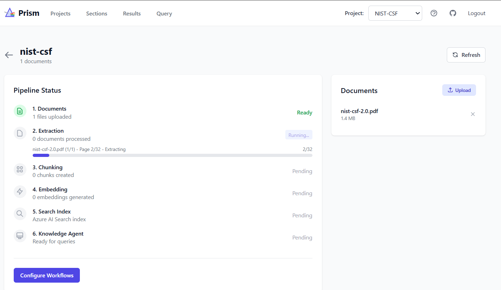

<!--
---
name: Prism - Transform Documents into Queryable Knowledge
description: End-to-end RAG pipeline with hybrid document extraction, Azure AI Search Knowledge Agents, and structured Q&A workflows.
languages:
- python
- typescript
- bicep
- azdeveloper
products:
- azure-openai
- azure-cognitive-search
- azure-container-apps
- azure
page_type: sample
urlFragment: prism-document-intelligence
---
-->

# Prism - Transform Documents into Queryable Knowledge

A production-grade RAG (Retrieval-Augmented Generation) platform that transforms unstructured documents into a searchable knowledge base with natural language querying powered by Azure AI Search Knowledge Agents.

[](https://codespaces.new/Azure-Samples/Prism---Transform-Data-into-Queryable-Knowledge?devcontainer_path=.devcontainer%2Fdevcontainer.json)
[](https://vscode.dev/redirect?url=vscode://ms-vscode-remote.remote-containers/cloneInVolume?url=https://github.com/Azure-Samples/Prism---Transform-Data-into-Queryable-Knowledge)

https://github.com/user-attachments/assets/f0a4770c-6efd-4935-afda-c3c19da93813

## Important Security Notice

This template is built to showcase Azure AI services. We strongly advise against using this code in production without implementing additional security features. See [productionizing guide](docs/productionizing.md).



## What Makes Prism Different

| Challenge | Prism's Solution |
|-----------|------------------|
| **Expensive Vision API calls** | Hybrid extraction: PyMuPDF4LLM extracts text locally (free), Vision AI only validates pages with images/diagrams. **70%+ cost reduction.** |
| **Poor table extraction** | pymupdf4llm preserves table structure as markdown. openpyxl extracts Excel with formulas and formatting. |
| **Lost document structure** | Structure-aware chunking respects markdown hierarchy (##, ###). Extracts section titles as metadata. |
| **Hallucinated answers** | Knowledge Agents with strict grounding instructions. Always cites sources with page numbers. Distinguishes "not found" vs "explicitly excluded." |
| **Manual Q&A workflows** | Define question templates per project. Run workflows against your knowledge base. Export results to CSV. |

## Features

### Document Extraction

**PDF Processing (Hybrid Approach)**
- **PyMuPDF + pymupdf4llm**: Fast, local text/table extraction with header/footer filtering
- **GPT-4.1 Vision**: Validates and enhances pages containing images, diagrams, or complex layouts
- **Smart optimization**: Text-only pages skip Vision entirely. Repeated images (logos, headers) auto-filtered.
- **Custom instructions**: Project-specific extraction prompts via `config.json`

**Excel Processing**
- **openpyxl**: Extracts all worksheets (including hidden), formulas, merged cells
- **AI enhancement**: Categorizes document type (BOQ, specifications, calculations)
- **Metadata extraction**: Equipment types, voltage levels, standards (IEC, IEEE, ANSI)

**Email Processing**
- **extract-msg**: Reliable .msg parsing with attachment extraction
- **AI enhancement**: Categorizes email type, extracts action items, deadlines, stakeholders
- **Attachment handling**: Automatically processes PDF/Excel/DOCX attachments

### RAG Pipeline

```
Upload → Extract → Deduplicate → Chunk → Embed → Index → Query
```

| Stage | What It Does |
|-------|--------------|
| **Extract** | Hybrid local + AI extraction to structured markdown |
| **Deduplicate** | SHA256 hashing removes duplicate content |
| **Chunk** | Structure-aware splitting with token counting (tiktoken) |
| **Embed** | text-embedding-3-large (1024 dimensions, batch processing) |
| **Index** | Azure AI Search with vector + keyword hybrid search |
| **Query** | Knowledge Agent with agentic retrieval and citations |

### Azure AI Search Knowledge Agents

Prism uses [Azure AI Search Knowledge Agents](https://learn.microsoft.com/azure/search/search-knowledge-agent) for intelligent document retrieval:

- **Query planning**: Breaks complex questions into focused subqueries
- **Parallel search**: Executes multiple searches simultaneously
- **Answer synthesis**: Generates grounded answers from retrieved chunks
- **Citation tracking**: Returns source documents with page numbers and relevance scores
- **Activity logging**: Shows query planning steps for transparency

### Workflow System

Define structured Q&A templates for systematic document analysis:

```json
{
  "sections": [
    {
      "name": "Technical Specifications",
      "template": "Answer based on technical documents. Provide specific values with units.",
      "questions": [
        { "question": "What is the rated voltage?", "instructions": "Check electrical specs" },
        { "question": "Operating temperature range?", "instructions": "Check environmental specs" }
      ]
    }
  ]
}
```

- Run workflows against your knowledge base
- Track completion percentage per section
- Export results to CSV
- Edit and comment on answers
- **Evaluation**: Assess answer quality with Azure AI Evaluation SDK (relevance, coherence, fluency, groundedness)

## Architecture

<!-- TODO: Create architecture diagram -->
<!--  -->

```
┌──────────────────────────────────────────────────────────────────────────────┐
│                         Document Processing                                   │
├──────────────────────────────────────────────────────────────────────────────┤
│                                                                              │
│  ┌─────────┐    ┌─────────────────────────────────────────┐                 │
│  │  PDFs   │───▶│  PyMuPDF4LLM (local) + Vision (if needed)│                 │
│  └─────────┘    └─────────────────────────────────────────┘                 │
│                                     │                                        │
│  ┌─────────┐    ┌─────────────────────────────────────────┐                 │
│  │  Excel  │───▶│  openpyxl + AI Enhancement Agent         │                 │
│  └─────────┘    └─────────────────────────────────────────┘                 │
│                                     │                                        │
│  ┌─────────┐    ┌─────────────────────────────────────────┐                 │
│  │  Email  │───▶│  extract-msg + AI Enhancement Agent      │                 │
│  └─────────┘    └─────────────────────────────────────────┘                 │
│                                     │                                        │
│                                     ▼                                        │
│                          ┌──────────────────┐                               │
│                          │  Structured      │                               │
│                          │  Markdown        │                               │
│                          └────────┬─────────┘                               │
└───────────────────────────────────┼──────────────────────────────────────────┘
                                    │
┌───────────────────────────────────┼──────────────────────────────────────────┐
│                         RAG Pipeline                                         │
├───────────────────────────────────┼──────────────────────────────────────────┤
│                                   ▼                                          │
│  ┌────────────┐   ┌────────────┐   ┌────────────┐   ┌────────────┐          │
│  │ Deduplicate│──▶│   Chunk    │──▶│   Embed    │──▶│   Index    │          │
│  │  (SHA256)  │   │ (tiktoken) │   │(3-large)   │   │  (Search)  │          │
│  └────────────┘   └────────────┘   └────────────┘   └────────────┘          │
└──────────────────────────────────────────────────────────────────────────────┘
                                    │
┌───────────────────────────────────┼──────────────────────────────────────────┐
│                         Query & Workflows                                    │
├───────────────────────────────────┼──────────────────────────────────────────┤
│                                   ▼                                          │
│  ┌─────────────────────────────────────────────────────────────────────┐    │
│  │                    Azure AI Search Knowledge Agent                   │    │
│  │  ┌──────────────┐  ┌──────────────┐  ┌──────────────────────────┐  │    │
│  │  │Query Planning│─▶│Parallel Search│─▶│Answer Synthesis + Citations│  │    │
│  │  └──────────────┘  └──────────────┘  └──────────────────────────┘  │    │
│  └─────────────────────────────────────────────────────────────────────┘    │
│                                   │                                          │
│                    ┌──────────────┴──────────────┐                          │
│                    ▼                             ▼                          │
│            ┌─────────────┐               ┌─────────────┐                    │
│            │  Ad-hoc     │               │  Workflow   │                    │
│            │  Queries    │               │  Automation │                    │
│            └─────────────┘               └─────────────┘                    │
└──────────────────────────────────────────────────────────────────────────────┘
```

## Tech Stack

### Local Processing (No API Costs)

| Library | Purpose |
|---------|---------|
| **PyMuPDF + pymupdf4llm** | PDF text/table extraction with layout detection |
| **openpyxl** | Excel extraction with formula support |
| **extract-msg** | Outlook .msg email parsing |
| **tiktoken** | Token counting for accurate chunk sizing |
| **LangChain** | MarkdownHeaderTextSplitter for structure-aware chunking |

### Azure Services

| Service | Purpose |
|---------|---------|
| **Azure OpenAI** | GPT-4.1 (chat), gpt-5-chat (workflows), GPT-4.1 Vision, text-embedding-3-large |
| **Azure AI Search** | Vector + hybrid search, semantic ranking, Knowledge Agents |
| **Azure Blob Storage** | Document and project data storage |
| **Container Apps** | Serverless hosting for backend/frontend |
| **AI Foundry** | Model deployments and management |
| **Application Insights** | Monitoring and logging |
| **Azure AI Evaluation SDK** | Answer quality assessment (relevance, coherence, fluency, groundedness) |

### Application

| Component | Technology |
|-----------|------------|
| **Backend** | FastAPI (Python 3.11) |
| **Frontend** | Vue 3 + Vite + TailwindCSS + Pinia |
| **Infrastructure** | Bicep + Azure Developer CLI |

## Getting Started

### Prerequisites

- Azure subscription with permissions to create resources
- [Azure Developer CLI](https://aka.ms/azd-install)
- [Docker](https://docs.docker.com/get-docker/)

### Deploy

```bash
# Clone and deploy
git clone https://github.com/Azure-Samples/Prism---Transform-Data-into-Queryable-Knowledge.git
cd Prism---Transform-Data-into-Queryable-Knowledge

azd auth login
azd up
```

**What gets deployed:**
- AI Foundry with GPT-4.1, gpt-5-chat (workflows), text-embedding-3-large
- Azure AI Search with semantic ranking enabled
- Azure Blob Storage for project data
- Container Apps (backend + frontend)
- Container Registry, Log Analytics, Application Insights

**Get the auth password:**
```bash
az containerapp secret show --name prism-backend --resource-group <your-rg> --secret-name auth-password --query value -o tsv
```

### Run Locally (after deploying to Azure)

After running `azd up`, generate a local `.env` file from your deployed Container App:

```bash
# Set your resource group
RG=<your-rg>

# Get environment variables and secrets
az containerapp show --name prism-backend --resource-group $RG \
  --query "properties.template.containers[0].env[?value!=null].{name:name, value:value}" \
  -o tsv | awk '{print $1"="$2}' > .env

# Append secrets
echo "AZURE_OPENAI_API_KEY=$(az containerapp secret show --name prism-backend --resource-group $RG --secret-name ai-services-key --query value -o tsv)" >> .env
echo "AZURE_SEARCH_ADMIN_KEY=$(az containerapp secret show --name prism-backend --resource-group $RG --secret-name search-admin-key --query value -o tsv)" >> .env
echo "AUTH_PASSWORD=$(az containerapp secret show --name prism-backend --resource-group $RG --secret-name auth-password --query value -o tsv)" >> .env
```

Then run locally:
```bash
docker-compose -f infra/docker/docker-compose.yml --env-file .env up -d
```

Access at http://localhost:3000

## Project Structure

```
prism/
├── apps/
│   ├── api/                      # FastAPI backend
│   │   └── app/
│   │       ├── api/              # REST endpoints
│   │       └── services/         # Pipeline, workflow, storage services
│   └── web/                      # Vue 3 frontend
│       └── src/views/            # Dashboard, Query, Workflows, Results
├── scripts/
│   ├── extraction/               # Document extractors
│   │   ├── pdf_extraction_hybrid.py    # PyMuPDF4LLM + Vision
│   │   ├── excel_extraction_agents.py  # openpyxl + AI
│   │   └── email_extraction_agents.py  # extract-msg + AI
│   ├── rag/                      # RAG pipeline
│   │   ├── deduplicate_documents.py
│   │   ├── chunk_documents.py    # Structure-aware chunking
│   │   └── generate_embeddings.py
│   ├── search_index/             # Azure AI Search
│   │   ├── create_search_index.py
│   │   ├── create_knowledge_source.py
│   │   └── create_knowledge_agent.py
│   └── evaluation/               # Answer quality evaluation
│       └── evaluate_results.py
├── workflows/
│   └── workflow_agent.py         # Q&A workflow execution
└── infra/
    ├── bicep/                    # Azure infrastructure
    └── docker/                   # Local development (includes Azurite)
```

## Storage

All project data is stored in Azure Blob Storage:

- **Production**: Azure Blob Storage with managed identity authentication
- **Local Development**: Azurite (Azure Storage emulator, included in docker-compose)

```
Container: prism-projects
└── {project-name}/
    ├── documents/            # Uploaded files
    ├── output/               # Processed results
    │   ├── extraction_results/*.md
    │   ├── chunked_documents/*.json
    │   ├── embedded_documents/*.json
    │   └── results.json      # Workflow answers + evaluations
    ├── config.json           # Extraction instructions
    └── workflow_config.json  # Q&A templates
```

Browse local storage with [Azure Storage Explorer](https://azure.microsoft.com/features/storage-explorer/) connected to `http://localhost:10000`.

## Cost Estimation

| Service | SKU | Pricing |
|---------|-----|---------|
| Azure Container Apps | Consumption | [Pricing](https://azure.microsoft.com/pricing/details/container-apps/) |
| Azure OpenAI | Standard | [Pricing](https://azure.microsoft.com/pricing/details/cognitive-services/openai-service/) |
| Azure AI Search | Basic | [Pricing](https://azure.microsoft.com/pricing/details/search/) |

> **Cost optimization**: Hybrid PDF extraction reduces Vision API calls by 70%+ compared to full-vision approaches.

## Clean Up

```bash
azd down
```

## Documentation

- [Quick Start](docs/QUICKSTART.md) - Get running in 5 minutes
- [User Guide](docs/USER_GUIDE.md) - Complete usage instructions
- [Architecture](docs/architecture.md) - System design details
- [Data Ingestion](docs/data_ingestion.md) - Supported formats and pipeline
- [Troubleshooting](docs/troubleshooting.md) - Common issues
- [Productionizing](docs/productionizing.md) - Production readiness
- [Local Development](docs/localdev.md) - Development setup

## Resources

- [Azure AI Search Knowledge Agents](https://learn.microsoft.com/azure/search/search-knowledge-agent)
- [Azure OpenAI Service](https://learn.microsoft.com/azure/cognitive-services/openai/overview)
- [pymupdf4llm Documentation](https://pymupdf.readthedocs.io/en/latest/pymupdf4llm/)

## Getting Help

- [GitHub Issues](../../issues)

## License

MIT License - see [LICENSE](LICENSE)

## Trademarks

This project may contain trademarks or logos for projects, products, or services. Authorized use of Microsoft trademarks or logos is subject to and must follow [Microsoft's Trademark & Brand Guidelines](https://www.microsoft.com/en-us/legal/intellectualproperty/trademarks/usage/general).
