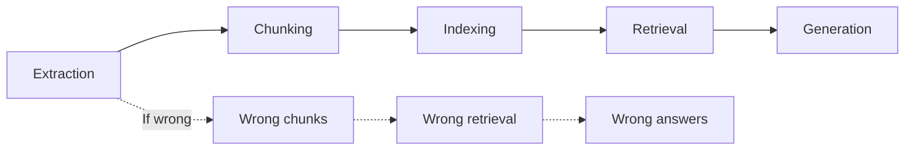
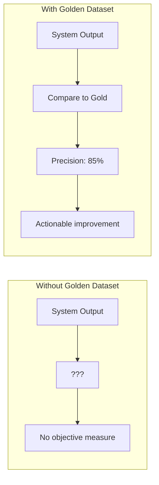
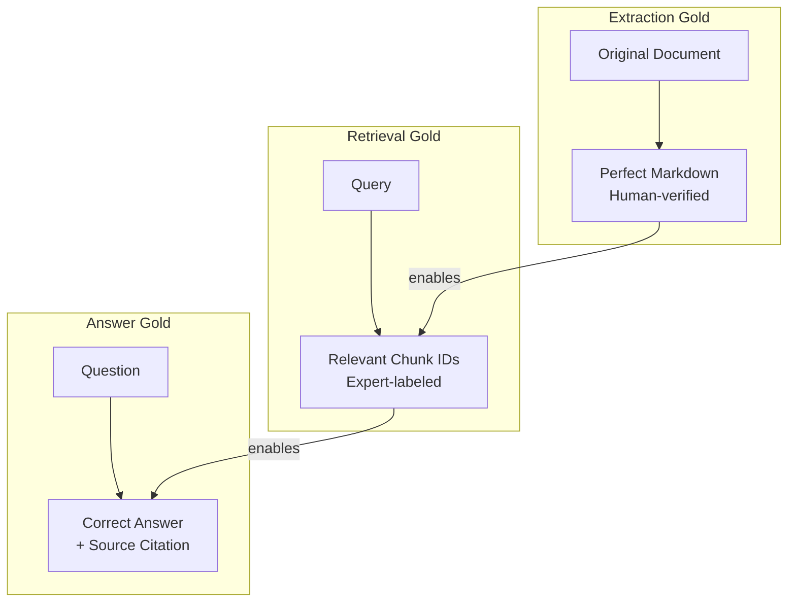
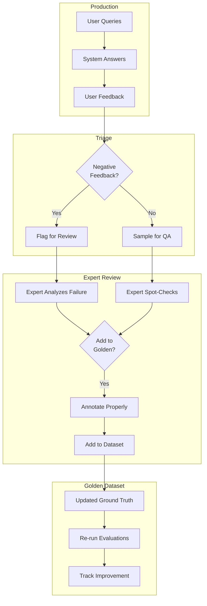

# Evaluation Strategies for RAG Systems

A comprehensive framework for evaluating each stage of the PrismRAG pipeline, from document extraction through answer generation.

## Overview

RAG system quality depends on every stage of the pipeline. A failure at any point propagates downstream:



This document outlines evaluation strategies at each stage, considering three evaluator types:

| Evaluator Type | Strengths | Limitations | Best For |
|----------------|-----------|-------------|----------|
| **Human (General)** | Common sense, UX feedback | Expensive, slow, not scalable | Final QA, edge cases |
| **Domain Expert** | Deep accuracy validation | Very expensive, limited availability | Ground truth creation, critical docs |
| **LLM-as-Judge** | Scalable, consistent, fast | May miss nuance, needs calibration | Automated CI/CD, bulk evaluation |

---

## Building Golden Datasets: From Raw Data to Ground Truth

### Why Golden Datasets Matter

A **golden dataset** is a curated collection of ground-truth examples that serves as the authoritative benchmark for system evaluation. Without golden datasets, you cannot:



| Purpose | Why It's Critical |
|---------|-------------------|
| **Objective Measurement** | Without ground truth, you're guessing at quality |
| **Regression Detection** | Catch quality drops when changing the system |
| **Comparison Baseline** | Compare chunking strategies, models, prompts |
| **Debugging** | Identify exactly where failures occur |
| **Stakeholder Confidence** | Prove the system works with hard numbers |
| **Continuous Improvement** | Track progress over time |

### The Golden Dataset Hierarchy

Different stages require different types of ground truth:



### Types of Golden Datasets

| Dataset Type | Contents | Created By | Size | Update Frequency |
|--------------|----------|------------|------|------------------|
| **Extraction Gold** | Perfect markdown for sample pages | Domain expert | 50-100 pages | Per document type |
| **Chunk Gold** | Ideal chunk boundaries | Domain expert | 20-30 documents | When chunking changes |
| **Retrieval Gold** | Query → relevant chunks mapping | Domain expert | 100-200 queries | Quarterly |
| **Answer Gold** | Question → correct answer pairs | Domain expert | 100-500 Q&A pairs | Monthly additions |
| **Edge Case Gold** | Known difficult examples | All evaluators | 50-100 cases | Ongoing |

---

### Process: Raw Data → Ground Truth

#### Step 1: Document Selection

Select representative documents that cover:

```yaml
Selection Criteria:
  Document Types:
    - Text-heavy PDFs (policy documents, standards)
    - Table-heavy PDFs (control matrices, compliance mappings)
    - Diagram-heavy PDFs (architecture diagrams, process flows)
    - Mixed content (implementation guides, assessment reports)
    - Excel files (control inventories, risk registers)
    - Emails (audit communications, policy updates)
  
  Difficulty Levels:
    - Easy: Clean, well-structured documents
    - Medium: Some formatting complexity
    - Hard: Complex tables, diagrams, poor scans
  
  Domain Coverage:
    - All NIST CSF Functions (Identify, Protect, Detect, Respond, Recover)
    - Edge cases and exceptions
    - Documents users frequently query

Target: 10-20 documents spanning all categories
```

#### Step 2: Expert Annotation Sessions

##### Session Structure

```yaml
Annotation Session Format:
  Duration: 2-3 hours per session
  Participants:
    - 1-2 Domain experts
    - 1 Facilitator (technical lead)
    - 1 Scribe (documentation)
  
  Materials Prepared:
    - Selected documents (printed or screen-shared)
    - Annotation templates
    - System outputs for comparison (if available)
  
  Output:
    - Annotated ground truth
    - Expert reasoning notes
    - Disagreement log
```

##### Extraction Annotation Protocol

```yaml
Protocol: Perfect Extraction Creation
Purpose: Create gold-standard markdown for sample pages

For each selected page:
  1. Expert reviews original PDF page
  2. Expert writes or corrects extracted markdown:
     - All text verbatim
     - Tables with exact structure
     - Image descriptions that capture meaning
     - Diagram relationships explicitly stated
  
  3. Expert annotates special elements:
     - Technical terms: [TERM: definition if unclear]
     - Critical controls: [CRITICAL: this control is required for compliance]
     - Relationships: [RELATIONSHIP: Control X supports Category Y]
  
  Quality Check:
    - Second expert reviews independently
    - Disagreements resolved by discussion
    - Final version approved by both

Output Format:
  {
    "document": "nist_csf_guide.pdf",
    "page": 5,
    "original_image": "base64...",
    "gold_markdown": "## PR.AC - Access Control\n\n...",
    "annotations": [
      {"type": "control_id", "text": "PR.AC-1", "note": "Identity management control"},
      {"type": "diagram", "description": "Control hierarchy showing Protect function subcategories..."}
    ],
    "expert": "John Smith",
    "reviewed_by": "Jane Doe",
    "created_at": "2025-01-15"
  }
```

##### Retrieval Annotation Protocol

```yaml
Protocol: Relevance Judgment Collection
Purpose: Create query → relevant chunks mapping

Preparation:
  1. Generate 100-200 representative queries:
     - From actual user questions (if available)
     - From document headings converted to questions
     - Expert-generated questions covering key topics
     - Adversarial/edge-case questions
  
  2. For each query, retrieve top 20 chunks from system

Annotation Session:
  For each query:
    1. Expert reads query carefully
    2. Expert reviews each of 20 retrieved chunks
    3. Expert assigns relevance score:
       - 3: HIGHLY RELEVANT - Directly answers the query
       - 2: RELEVANT - Contains useful supporting information
       - 1: MARGINALLY RELEVANT - Tangentially related
       - 0: NOT RELEVANT - Does not help answer
    
    4. Expert identifies any MISSING chunks:
       - "I know document X, page Y has relevant info"
       - These are added with score 3

  Guidelines for Experts:
    - Consider: "Would this chunk help answer the question?"
    - Don't require exact match - semantic relevance counts
    - Rate independently, then discuss disagreements
    - Document reasoning for edge cases

Output Format:
  {
    "query_id": "q_047",
    "query": "What controls address identity management and access control?",
    "judgments": {
      "chunk_abc123": {"score": 3, "reason": "Directly describes PR.AC-1 through PR.AC-7"},
      "chunk_def456": {"score": 2, "reason": "Mentions access control but focuses on authentication"},
      "chunk_ghi789": {"score": 0, "reason": "About incident response, not access control"}
    },
    "missing_chunks": [
      {"document": "csf_implementation_guide.pdf", "page": 12, "reason": "Detailed PR.AC implementation steps"}
    ],
    "annotator": "John Smith",
    "difficulty": "medium"
  }
```

##### Answer Annotation Protocol

```yaml
Protocol: Golden Answer Creation
Purpose: Create definitive correct answers for test questions

Question Categories:
  - Factual: Single correct answer ("What is the control ID for identity management?")
  - List: Multiple items expected ("What are the Protect function categories?")
  - Explanation: Conceptual answer ("How does the Detect function work?")
  - Comparison: Multiple elements ("Compare Tier 2 and Tier 3 implementation")
  - Not-Answerable: Intentionally unanswerable from docs

Annotation Session:
  For each question:
    1. Expert searches source documents manually
    2. Expert writes the ideal answer:
       - Factual: Exact value with units
       - List: All items, in logical order
       - Explanation: Key concepts, appropriate depth
    
    3. Expert provides source citations:
       - Document name
       - Page/section number
       - Direct quote if short
    
    4. Expert rates difficulty:
       - Easy: Answer in one obvious place
       - Medium: Requires finding across sections
       - Hard: Requires synthesis or inference
    
    5. Expert notes variations:
       - Acceptable alternative phrasings
       - Common mistakes to watch for

Output Format:
  {
    "question_id": "golden_042",
    "question": "What are the subcategories under PR.AC (Access Control)?",
    "category": "list",
    "golden_answer": "PR.AC-1 (Identities and credentials), PR.AC-2 (Physical access), PR.AC-3 (Remote access), PR.AC-4 (Access permissions), PR.AC-5 (Network integrity), PR.AC-6 (Identities proofing), PR.AC-7 (Authentication)",
    "acceptable_variations": [
      "The PR.AC subcategories are PR.AC-1 through PR.AC-7",
      "Access Control includes identity management, physical access, remote access, permissions, network integrity, identity proofing, and authentication"
    ],
    "sources": [
      {
        "document": "nist_csf_core.pdf",
        "page": 8,
        "quote": "PR.AC-1: Identities and credentials are issued, managed, verified, revoked, and audited"
      }
    ],
    "difficulty": "medium",
    "common_errors": [
      "Missing PR.AC-6 and PR.AC-7 (added in later versions)",
      "Confusing with ID.AM (Asset Management) controls"
    ],
    "annotator": "Jane Doe",
    "reviewer": "John Smith"
  }
```

#### Step 3: Quality Assurance

##### Inter-Annotator Agreement

```python
class InterAnnotatorAgreement:
    """Measure consistency between annotators."""
    
    def calculate_cohens_kappa(
        self, 
        annotator1_scores: List[int], 
        annotator2_scores: List[int]
    ) -> float:
        """
        Cohen's Kappa for relevance judgments.
        
        Interpretation:
          < 0.20: Poor agreement
          0.21-0.40: Fair
          0.41-0.60: Moderate
          0.61-0.80: Substantial
          0.81-1.00: Almost perfect
        
        Target: > 0.70 for golden dataset quality
        """
        from sklearn.metrics import cohen_kappa_score
        return cohen_kappa_score(annotator1_scores, annotator2_scores)
    
    def identify_disagreements(
        self,
        annotations1: dict,
        annotations2: dict
    ) -> List[dict]:
        """Find cases where experts disagree significantly."""
        disagreements = []
        
        for query_id in annotations1:
            for chunk_id in annotations1[query_id]:
                score1 = annotations1[query_id][chunk_id]
                score2 = annotations2[query_id].get(chunk_id, None)
                
                if score2 is not None and abs(score1 - score2) >= 2:
                    disagreements.append({
                        "query_id": query_id,
                        "chunk_id": chunk_id,
                        "scores": [score1, score2],
                        "needs_resolution": True
                    })
        
        return disagreements
    
    def resolve_disagreements(
        self,
        disagreements: List[dict],
        resolution_method: str = "discussion"
    ) -> dict:
        """
        Resolution methods:
        - discussion: Experts discuss and agree
        - senior_expert: Senior expert decides
        - majority: Add third annotator, take majority
        - average: Use average score (for continuous)
        """
        resolved = {}
        for d in disagreements:
            if resolution_method == "average":
                resolved[d["chunk_id"]] = sum(d["scores"]) / len(d["scores"])
            else:
                # Placeholder - actual resolution happens in meetings
                resolved[d["chunk_id"]] = "NEEDS_DISCUSSION"
        
        return resolved
```

##### Validation Checks

```python
class GoldenDatasetValidator:
    """Validate golden dataset quality and completeness."""
    
    def validate_extraction_gold(self, dataset: List[dict]) -> dict:
        """Validate extraction ground truth."""
        issues = []
        
        for item in dataset:
            # Check required fields
            required = ["document", "page", "gold_markdown", "expert"]
            missing = [f for f in required if f not in item]
            if missing:
                issues.append(f"{item.get('document', '?')}: Missing {missing}")
            
            # Check markdown not empty
            if len(item.get("gold_markdown", "")) < 100:
                issues.append(f"{item['document']} p{item['page']}: Suspiciously short")
            
            # Check expert review
            if not item.get("reviewed_by"):
                issues.append(f"{item['document']} p{item['page']}: Not peer-reviewed")
        
        return {
            "valid": len(issues) == 0,
            "issues": issues,
            "coverage": self.check_coverage(dataset)
        }
    
    def validate_retrieval_gold(self, dataset: List[dict]) -> dict:
        """Validate retrieval ground truth."""
        issues = []
        
        for item in dataset:
            judgments = item.get("judgments", {})
            
            # Check minimum judgments per query
            if len(judgments) < 10:
                issues.append(f"{item['query_id']}: Only {len(judgments)} judgments")
            
            # Check at least some relevant chunks
            relevant = sum(1 for s in judgments.values() if s.get("score", 0) >= 2)
            if relevant == 0:
                issues.append(f"{item['query_id']}: No relevant chunks found")
            
            # Check score distribution isn't suspicious
            scores = [j.get("score", 0) for j in judgments.values()]
            if len(set(scores)) == 1:
                issues.append(f"{item['query_id']}: All same score - review needed")
        
        return {
            "valid": len(issues) == 0,
            "issues": issues,
            "query_count": len(dataset),
            "avg_judgments_per_query": np.mean([len(d["judgments"]) for d in dataset])
        }
    
    def validate_answer_gold(self, dataset: List[dict]) -> dict:
        """Validate answer ground truth."""
        issues = []
        
        for item in dataset:
            # Check answer has sources
            if not item.get("sources"):
                issues.append(f"{item['question_id']}: No source citations")
            
            # Check sources are specific
            for source in item.get("sources", []):
                if not source.get("page") and not source.get("section"):
                    issues.append(f"{item['question_id']}: Source lacks page/section")
            
            # Check question categories are balanced
            # (handled at dataset level)
        
        # Category distribution
        categories = [item.get("category", "unknown") for item in dataset]
        distribution = {c: categories.count(c) for c in set(categories)}
        
        return {
            "valid": len(issues) == 0,
            "issues": issues,
            "total_questions": len(dataset),
            "category_distribution": distribution,
            "difficulty_distribution": self.get_difficulty_distribution(dataset)
        }
```

#### Step 4: Dataset Management

##### Version Control for Ground Truth

```yaml
Golden Dataset Repository Structure:
  golden_datasets/
    ├── extraction/
    │   ├── v1.0/
    │   │   ├── metadata.json        # Version info, annotators
    │   │   ├── pages/
    │   │   │   ├── nist_csf_core_p8.json
    │   │   │   ├── implementation_guide_p15.json
    │   │   │   └── ...
    │   │   └── validation_report.json
    │   └── v1.1/                    # Updated version
    │
    ├── retrieval/
    │   ├── v1.0/
    │   │   ├── metadata.json
    │   │   ├── queries.json         # All queries with judgments
    │   │   └── inter_annotator_agreement.json
    │   └── v1.1/
    │
    └── answers/
        ├── v1.0/
        │   ├── metadata.json
        │   ├── factual_questions.json
        │   ├── list_questions.json
        │   ├── explanation_questions.json
        │   └── edge_cases.json
        └── v1.1/

Versioning Policy:
  - Minor version (1.x): Add new examples, fix errors
  - Major version (x.0): Significant methodology change
  - Always keep previous versions for comparison
```

##### Continuous Enrichment Process



```python
class GoldenDatasetEnrichment:
    """Process for continuously improving golden datasets."""
    
    def identify_candidates_from_feedback(
        self,
        feedback_log: List[dict],
        min_negative_rate: float = 0.3
    ) -> List[dict]:
        """Find queries that frequently get negative feedback."""
        query_feedback = defaultdict(list)
        
        for entry in feedback_log:
            query_feedback[entry["query"]].append(entry["rating"])
        
        candidates = []
        for query, ratings in query_feedback.items():
            negative_rate = sum(1 for r in ratings if r < 3) / len(ratings)
            if negative_rate >= min_negative_rate and len(ratings) >= 3:
                candidates.append({
                    "query": query,
                    "negative_rate": negative_rate,
                    "sample_count": len(ratings),
                    "priority": "high" if negative_rate > 0.5 else "medium"
                })
        
        return sorted(candidates, key=lambda x: x["negative_rate"], reverse=True)
    
    def sample_for_qa(
        self,
        production_queries: List[dict],
        sample_rate: float = 0.05,
        stratify_by: str = "query_type"
    ) -> List[dict]:
        """Random sample of production queries for quality assurance."""
        # Stratified sampling ensures coverage
        strata = defaultdict(list)
        for q in production_queries:
            strata[q.get(stratify_by, "unknown")].append(q)
        
        sample = []
        for stratum, queries in strata.items():
            n_sample = max(1, int(len(queries) * sample_rate))
            sample.extend(random.sample(queries, n_sample))
        
        return sample
    
    def prepare_annotation_batch(
        self,
        candidates: List[dict],
        batch_size: int = 20
    ) -> dict:
        """Prepare a batch for expert annotation session."""
        batch = candidates[:batch_size]
        
        return {
            "batch_id": f"batch_{datetime.now().strftime('%Y%m%d')}",
            "created_at": datetime.now().isoformat(),
            "items": batch,
            "instructions": self.get_annotation_instructions(),
            "estimated_time": f"{len(batch) * 3} minutes",  # ~3 min per item
            "required_annotators": 2
        }
```

---

### Expert Recruitment and Training

#### Who Should Be Domain Experts?

```yaml
Ideal Domain Expert Profile:
  Required:
    - 3+ years experience with document domain
    - Deep familiarity with terminology and concepts
    - Ability to distinguish correct from incorrect information
    - Available for 4-8 hours of annotation work
  
  Preferred:
    - Experience answering questions from documents
    - Understanding of how the system will be used
    - Patience for detailed, repetitive work
    - Good written communication
  
  Sources:
    - Internal subject matter experts
    - Technical writers familiar with documents
    - Support staff who answer customer questions
    - Consultants with domain expertise

Compensation:
    - Internal: Dedicated time allocation (not "on top of" day job)
    - External: Market rate for consulting ($100-300/hr for specialists)
```

#### Training Protocol

```yaml
Expert Training Session (2 hours):
  
  Part 1: System Overview (30 min)
    - How the RAG system works
    - Why ground truth matters
    - How their annotations will be used
  
  Part 2: Annotation Guidelines (45 min)
    - Scoring criteria with examples
    - Edge cases and how to handle
    - When to flag for discussion vs. decide
    - Documentation requirements
  
  Part 3: Practice Annotations (30 min)
    - Annotate 5-10 examples together
    - Discuss disagreements
    - Calibrate scoring approach
  
  Part 4: Q&A and Logistics (15 min)
    - Schedule sessions
    - Tool access
    - Communication channels

Calibration:
  - First 20 annotations reviewed by facilitator
  - Feedback session to align scoring
  - Re-calibrate quarterly or when new experts join
```

---

### Cost-Benefit Analysis

#### Investment Required

| Activity | Time | People | Total Hours | Notes |
|----------|------|--------|-------------|-------|
| Document selection | 4 hrs | 1 tech lead | 4 | One-time |
| Extraction gold (100 pages) | 20 hrs | 2 experts | 40 | 10-15 min/page |
| Retrieval gold (150 queries) | 30 hrs | 2 experts | 60 | 20 chunks × 1 min each |
| Answer gold (200 Q&A) | 40 hrs | 2 experts | 80 | 10-15 min/question |
| Quality assurance | 10 hrs | 1 lead | 10 | Validation, resolution |
| **Total Initial** | | | **~200 hrs** | |
| Ongoing enrichment | 4 hrs/mo | 1 expert | 48/yr | Continuous |

#### ROI Justification

```yaml
Without Golden Dataset:
  - Unknown system quality (risk)
  - Cannot measure improvements
  - Cannot catch regressions
  - Stakeholder concerns about accuracy
  - Potential production failures

With Golden Dataset:
  - Quantified accuracy metrics
  - Regression testing in CI/CD
  - Data-driven optimization
  - Stakeholder confidence
  - Faster debugging (know where failures occur)

ROI Calculation:
  Investment: ~200 hours × $100/hr = $20,000
  
  Value:
    - Avoid 1 production incident: $10,000-50,000
    - Reduce debugging time 50%: $5,000/year
    - Faster feature validation: $10,000/year
    - Stakeholder confidence: Priceless
  
  Payback: 3-6 months
```

---

### Tools and Templates

#### Annotation Interface Recommendations

```yaml
For Extraction Annotation:
  - Side-by-side PDF viewer + markdown editor
  - Tools: Label Studio, Prodigy, custom web app
  
For Retrieval Annotation:
  - Query display + scrollable chunk list with radio buttons
  - Tools: Argilla, Label Studio, spreadsheet
  
For Answer Annotation:
  - Question + document search + answer editor
  - Tools: Custom form, Notion, structured spreadsheet

Key Features Needed:
  - Easy navigation between items
  - Keyboard shortcuts for scoring
  - Save progress frequently
  - Export to JSON
  - Track annotator ID and timestamp
```

#### Sample Annotation Templates

```json
// Retrieval Annotation Template (for spreadsheet)
{
  "columns": [
    "query_id",
    "query_text", 
    "chunk_id",
    "chunk_preview",  // First 200 chars
    "chunk_source",   // Document + page
    "relevance_score", // 0-3
    "reasoning",       // Free text
    "annotator",
    "timestamp"
  ]
}
```

```json
// Answer Annotation Template
{
  "question_id": "",
  "question": "",
  "category": "factual|list|explanation|comparison|not_answerable",
  "difficulty": "easy|medium|hard",
  "golden_answer": "",
  "acceptable_variations": [],
  "sources": [
    {"document": "", "page": "", "quote": ""}
  ],
  "common_errors": [],
  "notes": "",
  "annotator": "",
  "reviewer": "",
  "status": "draft|reviewed|approved"
}
```

---

## Stage 1: Extraction Evaluation

### What to Measure

| Metric | Description | Target |
|--------|-------------|--------|
| **Text Completeness** | % of text content extracted | >98% |
| **Table Accuracy** | Row/column preservation | >95% |
| **Image Description Quality** | Semantic accuracy of vision descriptions | >90% |
| **Structure Preservation** | Headers, lists, formatting retained | >95% |
| **Complex Construct Extraction** | Diagrams, flowcharts, schematics | >85% |

### Complex Constructs Challenge

Cybersecurity framework documents often contain:
- **Control hierarchy diagrams** (Functions, Categories, Subcategories)
- **Flowcharts** with decision logic (risk assessment processes)
- **Architecture diagrams** (security reference architectures)
- **Mapping tables** (CSF to ISO 27001, COBIT, etc.)
- **Multi-part figures** with implementation tiers and maturity levels

Current extraction may miss semantic relationships within these constructs.

### Evaluation Methods

#### Human Evaluation

```yaml
Protocol: Side-by-Side Comparison
Process:
  1. Present original PDF page alongside extracted markdown
  2. Evaluator scores on 1-5 (Likert) scale for each criterion
  3. Flag specific missing/incorrect elements
  
Criteria:
  - Text accuracy (verbatim match)
  - Table structure (rows, columns, merged cells)
  - Image description (captures key information)
  - Diagram semantics (relationships, flows, labels)
  
Sample Size: 50-100 pages per document type
Evaluators: 2-3 per sample for inter-rater reliability
```

#### Domain Expert Evaluation

```yaml
Protocol: Technical Accuracy Review
Focus Areas:
  - Are control IDs and references correctly extracted?
  - Are framework hierarchies accurately described?
  - Are cybersecurity-specific terms and abbreviations preserved?
  - Are cross-references (CSF to other standards) intact?

Expert Tasks:
  1. Review extraction of 10-20 critical pages per doc type
  2. Create "gold standard" extractions for benchmarking
  3. Identify extraction failure patterns by document type
  
Deliverables:
  - Annotated extraction quality report
  - Gold standard dataset for automated testing
  - Domain-specific extraction guidelines
```

#### LLM-as-Judge Evaluation

```python
EXTRACTION_EVAL_PROMPT = """
You are evaluating the quality of document extraction.

ORIGINAL PAGE IMAGE:
[attached]

EXTRACTED MARKDOWN:
{extracted_markdown}

Evaluate on these criteria (1-5 scale):

1. TEXT_COMPLETENESS: Is all visible text captured?
2. TABLE_ACCURACY: Are tables properly structured with correct data?
3. IMAGE_DESCRIPTION: Are images/diagrams meaningfully described?
4. STRUCTURE: Are headers, lists, and formatting preserved?
5. TECHNICAL_ACCURACY: Are numbers, units, and specifications correct?

For each criterion, provide:
- Score (1-5)
- Specific examples of issues found
- Suggested corrections

Output as JSON.
"""

def evaluate_extraction(page_image: bytes, extracted_md: str) -> dict:
    response = llm.invoke(
        EXTRACTION_EVAL_PROMPT.format(extracted_markdown=extracted_md),
        images=[page_image]
    )
    return parse_evaluation(response)
```

### Automated Extraction Tests

```python
class ExtractionTestSuite:
    """Automated tests for extraction quality."""
    
    def test_table_extraction(self):
        """Verify tables have correct row/column counts."""
        for test_case in TABLE_TEST_CASES:
            extracted = extract_pdf(test_case.pdf_path)
            tables = parse_tables(extracted)
            
            assert len(tables) == test_case.expected_table_count
            for table, expected in zip(tables, test_case.expected_tables):
                assert table.row_count == expected.rows
                assert table.col_count == expected.cols
    
    def test_diagram_description(self):
        """Verify diagrams are described with key elements."""
        for test_case in DIAGRAM_TEST_CASES:
            extracted = extract_pdf(test_case.pdf_path)
            
            # Check that key elements are mentioned
            for required_element in test_case.required_elements:
                assert required_element.lower() in extracted.lower(), \
                    f"Missing element: {required_element}"
    
    def test_specification_accuracy(self):
        """Verify technical specifications are correctly extracted."""
        for test_case in SPEC_TEST_CASES:
            extracted = extract_pdf(test_case.pdf_path)
            
            for spec in test_case.specifications:
                # Check value appears with correct unit
                pattern = rf"{spec.value}\s*{spec.unit}"
                assert re.search(pattern, extracted), \
                    f"Missing spec: {spec.value} {spec.unit}"
```

### Recommended Metrics Dashboard

```
Extraction Quality Dashboard
━━━━━━━━━━━━━━━━━━━━━━━━━━━━
Document Type    | Text | Tables | Images | Diagrams | Overall
─────────────────|──────|────────|────────|──────────|────────
PDF (text-heavy) | 99%  | 95%    | N/A    | N/A      | 97%
PDF (technical)  | 96%  | 92%    | 88%    | 75%      | 88%
Excel            | 100% | 98%    | N/A    | N/A      | 99%
Email (.msg)     | 99%  | 90%    | 85%    | N/A      | 93%
```

---

## Stage 2: Chunking & Indexing Evaluation

### What to Measure

| Metric | Description | Target |
|--------|-------------|--------|
| **Chunk Coherence** | Does each chunk make sense standalone? | >90% |
| **Context Preservation** | Is necessary context included? | >85% |
| **Boundary Quality** | Are splits at logical points? | >90% |
| **Retrieval Precision** | Right chunks for known queries | >80% |
| **No Information Loss** | All content appears in some chunk | 100% |

### The "Can You Find It?" Test

The most practical chunking evaluation: given known facts in documents, can simple queries retrieve the right chunks?

```python
class ChunkRetrievalTest:
    """Test that known facts are retrievable."""
    
    # Test cases: (query, expected_chunk_contains)
    TEST_CASES = [
        {
            "query": "What controls address access management?",
            "must_contain": ["PR.AC", "access", "control"],
            "source_doc": "nist_csf_core.pdf",
            "source_page": 8
        },
        {
            "query": "Detect function categories",
            "must_contain": ["DE.AE", "DE.CM", "DE.DP"],
            "source_doc": "nist_csf_core.pdf", 
            "source_page": 12
        },
        # ... more test cases
    ]
    
    def test_known_fact_retrieval(self):
        for case in self.TEST_CASES:
            # Retrieve top-k chunks
            results = search_index(case["query"], top_k=5)
            
            # Check if any result contains required content
            found = False
            for chunk in results:
                if all(term.lower() in chunk.content.lower() 
                       for term in case["must_contain"]):
                    found = True
                    break
            
            assert found, f"Failed to retrieve: {case['query']}"
    
    def test_chunk_source_accuracy(self):
        """Verify chunk metadata points to correct source."""
        for case in self.TEST_CASES:
            results = search_index(case["query"], top_k=1)
            chunk = results[0]
            
            assert case["source_doc"] in chunk.source_file
            assert f"Page {case['source_page']}" in chunk.location
```

### Chunk Coherence Evaluation

#### LLM-as-Judge for Coherence

```python
COHERENCE_EVAL_PROMPT = """
Evaluate this text chunk for standalone coherence.

CHUNK:
{chunk_content}

Questions:
1. SELF_CONTAINED (1-5): Can this be understood without additional context?
2. COMPLETE_THOUGHT (1-5): Does it contain complete sentences/ideas?
3. LOGICAL_BOUNDARIES (1-5): Does it start and end at logical points?
4. CONTEXT_AVAILABLE (1-5): Is the document/section context clear?

For low scores, explain what context is missing.
Output as JSON.
"""

def evaluate_chunk_coherence(chunks: List[str]) -> dict:
    scores = []
    for chunk in sample(chunks, min(100, len(chunks))):
        result = llm.invoke(COHERENCE_EVAL_PROMPT.format(chunk_content=chunk))
        scores.append(parse_scores(result))
    
    return {
        "avg_self_contained": mean([s["self_contained"] for s in scores]),
        "avg_complete_thought": mean([s["complete_thought"] for s in scores]),
        "avg_logical_boundaries": mean([s["logical_boundaries"] for s in scores]),
        "avg_context_available": mean([s["context_available"] for s in scores]),
        "problem_chunks": [s for s in scores if s["overall"] < 3]
    }
```

#### Human Evaluation Protocol

```yaml
Protocol: Chunk Quality Assessment
Sample: Random 50 chunks per project

For each chunk, evaluator answers:
  1. "Can you understand what this is about?" (Yes/Partial/No)
  2. "Does it contain complete information?" (Yes/Partial/No)
  3. "Would you know where to find more context?" (Yes/No)
  4. "Rate overall quality" (1-5)

Inter-rater reliability: Calculate Cohen's Kappa
Target: Kappa > 0.7 for consistency
```

### Index Quality Metrics

```python
class IndexQualityMetrics:
    """Measure index effectiveness."""
    
    def embedding_coverage(self) -> float:
        """What % of chunks have valid embeddings?"""
        total = count_chunks()
        embedded = count_embedded_chunks()
        return embedded / total
    
    def embedding_diversity(self) -> float:
        """Are embeddings well-distributed in vector space?"""
        embeddings = get_all_embeddings()
        # Calculate average pairwise distance
        distances = pairwise_cosine_distances(embeddings)
        return distances.mean()
    
    def duplicate_detection(self) -> List[Tuple]:
        """Find near-duplicate chunks that may hurt retrieval."""
        embeddings = get_all_embeddings()
        duplicates = []
        for i, j in combinations(range(len(embeddings)), 2):
            if cosine_similarity(embeddings[i], embeddings[j]) > 0.95:
                duplicates.append((chunk_ids[i], chunk_ids[j]))
        return duplicates
    
    def semantic_cluster_analysis(self) -> dict:
        """Analyze how chunks cluster semantically."""
        embeddings = get_all_embeddings()
        clusters = kmeans(embeddings, n_clusters=10)
        
        return {
            "cluster_sizes": Counter(clusters.labels_),
            "silhouette_score": silhouette_score(embeddings, clusters.labels_),
            "cluster_topics": [summarize_cluster(c) for c in clusters]
        }
```

---

## Stage 3: Retrieval Evaluation

### What to Measure

| Metric | Description | Target |
|--------|-------------|--------|
| **Precision@K** | Relevant docs in top K results | >70% |
| **Recall@K** | Found relevant docs / total relevant | >80% |
| **MRR** | Mean Reciprocal Rank of first relevant | >0.6 |
| **NDCG** | Normalized Discounted Cumulative Gain | >0.7 |
| **Hit Rate** | Queries with at least 1 relevant result | >90% |

### NDCG Implementation for RAG

NDCG (Normalized Discounted Cumulative Gain) measures ranking quality, accounting for position:

```python
import numpy as np

def dcg_at_k(relevance_scores: List[float], k: int) -> float:
    """Discounted Cumulative Gain at position k."""
    relevance = np.array(relevance_scores[:k])
    positions = np.arange(1, len(relevance) + 1)
    discounts = np.log2(positions + 1)
    return np.sum(relevance / discounts)

def ndcg_at_k(relevance_scores: List[float], k: int) -> float:
    """Normalized DCG - compares to ideal ranking."""
    dcg = dcg_at_k(relevance_scores, k)
    ideal_relevance = sorted(relevance_scores, reverse=True)
    idcg = dcg_at_k(ideal_relevance, k)
    return dcg / idcg if idcg > 0 else 0

# Example usage with relevance judgments
def evaluate_retrieval_ndcg(query: str, retrieved_chunks: List, 
                            relevance_judgments: Dict[str, float]) -> float:
    """
    Evaluate a single query's retrieval quality.
    
    relevance_judgments: {chunk_id: relevance_score}
        - 3: Perfectly relevant
        - 2: Relevant
        - 1: Marginally relevant
        - 0: Not relevant
    """
    scores = [relevance_judgments.get(chunk.id, 0) for chunk in retrieved_chunks]
    return ndcg_at_k(scores, k=10)
```

### Creating Relevance Judgments

#### Domain Expert Protocol

```yaml
Protocol: Relevance Judgment Collection
Purpose: Create ground truth for NDCG calculation

Process:
  1. Select 50-100 representative queries
  2. For each query, retrieve top 20 chunks
  3. Domain expert rates each chunk:
     - 3 = Directly answers the query
     - 2 = Contains relevant information
     - 1 = Tangentially related
     - 0 = Not relevant
  
Expert Guidelines:
  - Consider: Would this help answer the user's question?
  - Don't penalize for extra information
  - Rate based on content, not presentation
  
Output: relevance_judgments.json
  {
    "query_1": {
      "chunk_abc": 3,
      "chunk_def": 2,
      "chunk_ghi": 0,
      ...
    },
    ...
  }
```

#### LLM-as-Judge for Relevance

```python
RELEVANCE_EVAL_PROMPT = """
You are judging the relevance of a retrieved document chunk to a query.

QUERY: {query}

CHUNK:
{chunk_content}

Rate the relevance on this scale:
- 3: HIGHLY RELEVANT - Directly answers or addresses the query
- 2: RELEVANT - Contains useful information for answering
- 1: MARGINALLY RELEVANT - Tangentially related, might provide context
- 0: NOT RELEVANT - Does not help answer the query

Consider:
- Does the chunk contain information that would help answer the query?
- Is the information specific to what's being asked?
- Would a user find this helpful?

Output:
{
  "relevance_score": <0-3>,
  "reasoning": "<brief explanation>"
}
"""

def llm_relevance_judgment(query: str, chunk: str) -> int:
    response = llm.invoke(RELEVANCE_EVAL_PROMPT.format(
        query=query, chunk_content=chunk
    ))
    return json.loads(response)["relevance_score"]
```

### Retrieval Test Suite

```python
class RetrievalEvaluationSuite:
    """Comprehensive retrieval evaluation."""
    
    def __init__(self, relevance_judgments: dict):
        self.judgments = relevance_judgments
    
    def evaluate_all_queries(self) -> dict:
        results = {
            "ndcg@5": [],
            "ndcg@10": [],
            "precision@5": [],
            "recall@10": [],
            "mrr": [],
            "hit_rate": []
        }
        
        for query, chunk_relevance in self.judgments.items():
            retrieved = search_index(query, top_k=20)
            retrieved_ids = [c.id for c in retrieved]
            
            # Get relevance scores in retrieval order
            scores = [chunk_relevance.get(cid, 0) for cid in retrieved_ids]
            
            results["ndcg@5"].append(ndcg_at_k(scores, 5))
            results["ndcg@10"].append(ndcg_at_k(scores, 10))
            results["precision@5"].append(
                sum(1 for s in scores[:5] if s >= 2) / 5
            )
            
            # Recall: found relevant / total relevant
            relevant_ids = {cid for cid, s in chunk_relevance.items() if s >= 2}
            found_relevant = set(retrieved_ids[:10]) & relevant_ids
            results["recall@10"].append(
                len(found_relevant) / len(relevant_ids) if relevant_ids else 1.0
            )
            
            # MRR: 1 / position of first relevant
            for i, score in enumerate(scores):
                if score >= 2:
                    results["mrr"].append(1 / (i + 1))
                    break
            else:
                results["mrr"].append(0)
            
            # Hit rate: any relevant in top 10?
            results["hit_rate"].append(1 if any(s >= 2 for s in scores[:10]) else 0)
        
        return {metric: np.mean(values) for metric, values in results.items()}
```

---

## Stage 4: Generation (Answer) Evaluation

### Current Metrics (via Azure AI Evaluation SDK)

PrismRAG already implements:
- **Relevance**: Does the answer address the question?
- **Coherence**: Is the answer logically consistent?
- **Fluency**: Is the language natural?
- **Groundedness**: Is the answer supported by context?

### Additional Metrics to Consider

| Metric | Description | How to Measure |
|--------|-------------|----------------|
| **Factual Accuracy** | Are stated facts correct? | Domain expert review |
| **Completeness** | Does it fully answer the question? | Checklist comparison |
| **Conciseness** | Is it appropriately brief? | Token count, redundancy check |
| **Citation Accuracy** | Do citations support claims? | Citation verification |
| **Hallucination Rate** | % of unsupported claims | LLM + human review |

### Factual Accuracy Evaluation

#### Domain Expert Protocol

```yaml
Protocol: Factual Accuracy Review
Purpose: Verify generated answers against source documents

Process:
  1. Present: Question, Generated Answer, Source Documents
  2. Expert verifies each factual claim:
     - CORRECT: Claim matches source exactly
     - PARTIALLY CORRECT: Claim is close but imprecise
     - INCORRECT: Claim contradicts or misrepresents source
     - UNSUPPORTED: Claim has no basis in sources (hallucination)
  
Metrics:
  - Accuracy Rate: CORRECT / total claims
  - Hallucination Rate: UNSUPPORTED / total claims
  - Error Severity: Weighted score based on claim importance
```

#### LLM-as-Judge for Hallucination Detection

```python
HALLUCINATION_EVAL_PROMPT = """
You are detecting hallucinations in a generated answer.

QUESTION: {question}

GENERATED ANSWER: {answer}

SOURCE DOCUMENTS:
{sources}

For each factual claim in the answer:
1. Identify the claim
2. Find supporting evidence in sources (or note if none exists)
3. Rate: SUPPORTED, PARTIALLY_SUPPORTED, or HALLUCINATED

Output as JSON:
{
  "claims": [
    {
      "claim": "<the factual claim>",
      "evidence": "<quote from source or 'none'>",
      "rating": "SUPPORTED|PARTIALLY_SUPPORTED|HALLUCINATED",
      "severity": "LOW|MEDIUM|HIGH"
    }
  ],
  "overall_hallucination_rate": <0.0-1.0>,
  "summary": "<brief assessment>"
}
"""
```

### Citation Verification

```python
class CitationVerifier:
    """Verify that citations actually support the claims."""
    
    def verify_citations(self, answer: str, citations: List[dict]) -> dict:
        claims_with_citations = self.extract_cited_claims(answer)
        
        results = {
            "verified": 0,
            "partially_verified": 0,
            "not_verified": 0,
            "missing_citation": 0,
            "details": []
        }
        
        for claim, cited_source in claims_with_citations:
            # Retrieve the cited chunk
            chunk = self.get_chunk(cited_source)
            
            # LLM verification
            verification = self.llm_verify(claim, chunk.content)
            
            results[verification["status"]] += 1
            results["details"].append({
                "claim": claim,
                "citation": cited_source,
                "status": verification["status"],
                "explanation": verification["explanation"]
            })
        
        return results
```

### Answer Completeness Evaluation

```python
COMPLETENESS_EVAL_PROMPT = """
Evaluate if this answer fully addresses the question.

QUESTION: {question}

ANSWER: {answer}

Consider:
1. Does it address all parts of a multi-part question?
2. Does it provide sufficient detail?
3. Are there obvious follow-up questions left unanswered?
4. Is any critical information missing?

Rate completeness (1-5):
- 5: Fully complete, no gaps
- 4: Mostly complete, minor gaps
- 3: Addresses main points but missing details
- 2: Significant gaps
- 1: Does not adequately answer

Output:
{
  "completeness_score": <1-5>,
  "addressed_aspects": ["<what was covered>"],
  "missing_aspects": ["<what was not covered>"],
  "suggested_additions": ["<what should be added>"]
}
"""
```

---

## Stage 5: Prompt/Question Quality Evaluation

### What to Measure

| Metric | Description | Target |
|--------|-------------|--------|
| **Clarity** | Is the question unambiguous? | >90% clear |
| **Specificity** | Is it specific enough for good retrieval? | >85% |
| **Answerability** | Can it be answered from the documents? | >95% |
| **Scope Appropriateness** | Not too broad, not too narrow | >85% |
| **Bias-Free** | Doesn't lead to a particular answer | >95% |

### Question Quality Framework

#### LLM-as-Judge for Question Quality

```python
QUESTION_QUALITY_PROMPT = """
Evaluate the quality of this question for a document Q&A system.

QUESTION: {question}

CONTEXT: This question will be asked against technical documents about {domain}.

Evaluate:

1. CLARITY (1-5): Is the question unambiguous?
   - 5: Crystal clear, one interpretation
   - 3: Mostly clear, minor ambiguity
   - 1: Very ambiguous, multiple interpretations

2. SPECIFICITY (1-5): Is it specific enough?
   - 5: Very specific, will retrieve focused results
   - 3: Moderate, may retrieve broad results
   - 1: Too vague, will retrieve irrelevant results

3. ANSWERABILITY (1-5): Can documents likely answer this?
   - 5: Clearly answerable from technical docs
   - 3: Possibly answerable
   - 1: Unlikely to be in documents (opinion, future prediction)

4. SCOPE (1-5): Is the scope appropriate?
   - 5: Perfect scope for a single answer
   - 3: Slightly too broad/narrow
   - 1: Way too broad (book-length) or too narrow (trivial)

5. OBJECTIVITY (1-5): Is it bias-free?
   - 5: Neutral, open question
   - 3: Slight leading language
   - 1: Heavily leading or loaded question

For low scores, suggest improvements.

Output as JSON with scores and improvement suggestions.
"""

def evaluate_question_quality(question: str, domain: str) -> dict:
    result = llm.invoke(QUESTION_QUALITY_PROMPT.format(
        question=question, domain=domain
    ))
    return json.loads(result)
```

### Question Set Analysis

```python
class QuestionSetAnalyzer:
    """Analyze a set of workflow questions for quality."""
    
    def analyze_question_set(self, questions: List[str], domain: str) -> dict:
        individual_scores = []
        
        for q in questions:
            scores = evaluate_question_quality(q, domain)
            individual_scores.append(scores)
        
        # Aggregate analysis
        return {
            "total_questions": len(questions),
            "average_scores": {
                metric: np.mean([s[metric] for s in individual_scores])
                for metric in ["clarity", "specificity", "answerability", "scope", "objectivity"]
            },
            "problem_questions": [
                {"question": q, "scores": s}
                for q, s in zip(questions, individual_scores)
                if any(v < 3 for v in s.values() if isinstance(v, (int, float)))
            ],
            "improvement_suggestions": self.aggregate_suggestions(individual_scores),
            "coverage_analysis": self.analyze_coverage(questions)
        }
    
    def analyze_coverage(self, questions: List[str]) -> dict:
        """Analyze what topics/aspects the questions cover."""
        return llm.invoke(f"""
        Analyze this set of questions for topic coverage:
        
        {json.dumps(questions, indent=2)}
        
        Identify:
        1. Topics well-covered
        2. Potential gaps (important topics not asked about)
        3. Redundant questions (asking the same thing differently)
        4. Recommended additional questions
        """)
```

### Human/Expert Review Protocol

```yaml
Protocol: Question Set Review
Purpose: Validate workflow questions before deployment

Reviewers:
  - 1 domain expert (technical accuracy)
  - 1 documentation specialist (clarity)
  - 1 end-user representative (usefulness)

For each question, reviewers assess:
  1. "Is this question clear to you?" (Yes/No + comments)
  2. "Would answers to this be valuable?" (1-5)
  3. "Can our documents answer this?" (Yes/Partial/No)
  4. "Any suggested rewording?" (free text)

Consensus meeting:
  - Review flagged questions
  - Agree on final wording
  - Identify missing questions
```

---

## Stage 6: End-to-End Evaluation

### System-Level Metrics

| Metric | Description | How to Measure |
|--------|-------------|----------------|
| **Task Success Rate** | % of questions correctly answered | Human evaluation |
| **User Satisfaction** | End-user ratings | Survey (1-5 scale) |
| **Time to Answer** | Total latency | System metrics |
| **Answer Confidence** | System's own confidence | Calibration analysis |
| **Error Recovery** | How system handles failures | Failure injection testing |

### Golden Dataset Evaluation

Create a curated test set with known-correct answers:

```python
class GoldenDatasetEvaluator:
    """Evaluate against a curated golden dataset."""
    
    def __init__(self, golden_dataset: List[dict]):
        """
        golden_dataset: [
            {
                "question": "What are the five core functions of the NIST CSF?",
                "golden_answer": "Identify, Protect, Detect, Respond, Recover",
                "source": "nist_csf_core.pdf, page 3",
                "answer_type": "list",  # factual, list, explanation
                "difficulty": "easy"  # easy, medium, hard
            },
            ...
        ]
        """
        self.dataset = golden_dataset
    
    def evaluate(self) -> dict:
        results = []
        
        for item in self.dataset:
            # Get system answer
            system_answer = query_system(item["question"])
            
            # Compare to golden answer
            comparison = self.compare_answers(
                system_answer, 
                item["golden_answer"],
                item["answer_type"]
            )
            
            results.append({
                "question": item["question"],
                "golden": item["golden_answer"],
                "system": system_answer,
                "correct": comparison["correct"],
                "partial": comparison["partial"],
                "difficulty": item["difficulty"]
            })
        
        return {
            "overall_accuracy": mean([r["correct"] for r in results]),
            "partial_credit_accuracy": mean([
                1 if r["correct"] else 0.5 if r["partial"] else 0 
                for r in results
            ]),
            "by_difficulty": self.group_by(results, "difficulty"),
            "by_type": self.group_by(results, "answer_type"),
            "failures": [r for r in results if not r["correct"]]
        }
    
    def compare_answers(self, system: str, golden: str, answer_type: str) -> dict:
        """Use LLM to compare answers semantically."""
        prompt = f"""
        Compare these two answers:
        
        GOLDEN ANSWER: {golden}
        SYSTEM ANSWER: {system}
        ANSWER TYPE: {answer_type}
        
        Determine:
        - CORRECT: System answer is semantically equivalent to golden
        - PARTIAL: System answer is partially correct
        - INCORRECT: System answer is wrong or missing key information
        
        Output: {{"correct": bool, "partial": bool, "explanation": str}}
        """
        return json.loads(llm.invoke(prompt))
```

### A/B Testing Framework

```python
class ABTestFramework:
    """Compare two system configurations."""
    
    def run_ab_test(
        self, 
        test_queries: List[str],
        system_a: Callable,  # Current system
        system_b: Callable,  # New configuration
        evaluator: str = "llm"  # or "human"
    ) -> dict:
        results = []
        
        for query in test_queries:
            answer_a = system_a(query)
            answer_b = system_b(query)
            
            if evaluator == "llm":
                preference = self.llm_preference(query, answer_a, answer_b)
            else:
                preference = self.collect_human_preference(query, answer_a, answer_b)
            
            results.append({
                "query": query,
                "preference": preference,  # "A", "B", or "TIE"
                "answer_a": answer_a,
                "answer_b": answer_b
            })
        
        return {
            "system_a_wins": sum(1 for r in results if r["preference"] == "A"),
            "system_b_wins": sum(1 for r in results if r["preference"] == "B"),
            "ties": sum(1 for r in results if r["preference"] == "TIE"),
            "statistical_significance": self.calculate_significance(results),
            "details": results
        }
    
    def llm_preference(self, query: str, answer_a: str, answer_b: str) -> str:
        """LLM judges which answer is better."""
        prompt = f"""
        Which answer better addresses this question?
        
        QUESTION: {query}
        
        ANSWER A:
        {answer_a}
        
        ANSWER B:
        {answer_b}
        
        Consider: accuracy, completeness, clarity, citations.
        
        Output ONLY: "A", "B", or "TIE"
        """
        return llm.invoke(prompt).strip()
```

---

## Stage 7: Continuous Monitoring & Feedback

### Production Monitoring Metrics

```python
class ProductionMonitor:
    """Monitor RAG system in production."""
    
    def collect_metrics(self) -> dict:
        return {
            # Performance
            "avg_latency_ms": self.get_avg_latency(),
            "p95_latency_ms": self.get_p95_latency(),
            "error_rate": self.get_error_rate(),
            
            # Quality signals
            "avg_retrieval_score": self.get_avg_reranker_score(),
            "empty_result_rate": self.get_empty_result_rate(),
            "low_confidence_rate": self.get_low_confidence_rate(),
            
            # User signals
            "thumbs_up_rate": self.get_positive_feedback_rate(),
            "thumbs_down_rate": self.get_negative_feedback_rate(),
            "follow_up_question_rate": self.get_followup_rate(),
            
            # Content signals
            "avg_answer_length": self.get_avg_answer_tokens(),
            "citation_rate": self.get_citation_rate(),
            "not_found_rate": self.get_not_found_rate()
        }
```

### User Feedback Integration

```yaml
Feedback Collection:
  Implicit:
    - Time spent reading answer
    - Copy/paste actions
    - Follow-up questions asked
    - Return visits to same question
  
  Explicit:
    - Thumbs up/down
    - "Was this helpful?" prompt
    - Correction submissions
    - Rating (1-5 stars)

Feedback Loop:
  1. Aggregate feedback weekly
  2. Identify low-performing queries
  3. Analyze failure patterns:
     - Retrieval failures (wrong chunks)
     - Generation failures (wrong answers)
     - Question ambiguity
  4. Create improvement tasks:
     - Add to golden dataset
     - Adjust chunking
     - Update prompts
     - Retrain/fine-tune
```

---

## Summary: Evaluation at Each Stage

| Stage | Primary Metrics | Human Role | Expert Role | LLM-as-Judge Role |
|-------|-----------------|------------|-------------|-------------------|
| **Extraction** | Completeness, accuracy | Spot-check quality | Create gold standards | Automated comparison |
| **Chunking** | Coherence, boundaries | Review problem chunks | Validate technical splits | Coherence scoring |
| **Indexing** | Coverage, diversity | N/A | N/A | Embedding analysis |
| **Retrieval** | NDCG, Precision, Recall | Create test queries | Relevance judgments | Auto-judge relevance |
| **Generation** | Accuracy, groundedness | Final QA | Factual verification | Hallucination detection |
| **Questions** | Clarity, answerability | Usability feedback | Domain appropriateness | Quality scoring |
| **End-to-End** | Task success rate | User satisfaction | Complex case review | A/B preference |

---

## References

- [RAGAS: Automated Evaluation of RAG](https://docs.ragas.io/)
- [NDCG Explained](https://en.wikipedia.org/wiki/Discounted_cumulative_gain)
- [LLM-as-Judge (LMSYS)](https://arxiv.org/abs/2306.05685)
- [Azure AI Evaluation SDK](https://learn.microsoft.com/azure/ai-studio/how-to/develop/evaluate-sdk)
- [Retrieval Evaluation Best Practices](https://www.pinecone.io/learn/retrieval-evaluation/)
